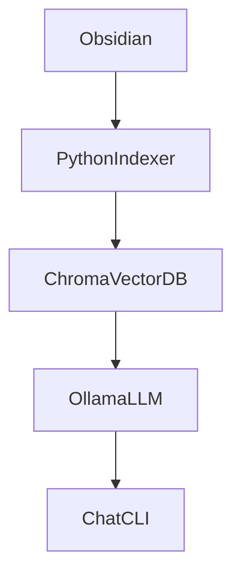

TL;DR

This repo is containing scripts (RAG Pipeline) for creating a minimalistic second brain for local AI setup 

Vision: have a Andrej Karpathy LLM Wiki


# secondBrain

With the inspiration of Andrej Karpathy's LLM wiki (https://gist.github.com/karpathy/442a6bf555914893e9891c11519de94f), I am considering building a second brain type of setup for work and private use speratate in different obsidian vaults but sharing the same RAG pipeline.

The idea is to have structured data available for local LLM models - I will also try to follo Luhmann's "Zettelkasten" method extended with RAG functionality for PDFs and so on.

## TechStack is the following:
- Obsidian for storing notes and ideas in .md files
- ChromaDB for Embeddings
- Python RAG Pipeline to chunk and embed files and contents (later replaced through OpenWebUI)
- Ollama local LLM
- (OpenWebUI running as Chat UI and providing some functionality)
- Later: graphify & automated ingest pipeline for a LLM to automatically analyze repositories and chat history to create a powerful always updated and self-learning second Brain

## Flow:


## How to get started

Change .env.local to .env and fill the things to adapt.
You will need to following Env variables:
```
VAULT_PATH=
CHROMA_PATH=
EMBEDDING_MODEL=
RERANKING_MODEL=
LLM_MODEL=
````
